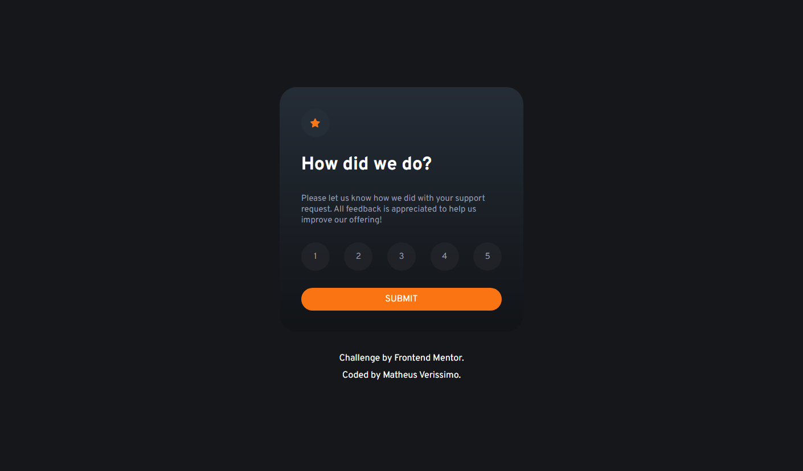

# Frontend Mentor - Interactive rating component

Esta é uma solução para o [Interactive rating component challenge on Frontend Mentor](https://www.frontendmentor.io/challenges/interactive-rating-component-koxpeBUmI).

## Screenshots

## Aprendizados

Neste projeto eu pude aplicar e treinar meus conhecimentos em CSS e JavaScript.

## Construído com

-   HTML5
-   CSS3
-   JavaScript

## Autores

-   [@Mveryy](https://github.com/Mveryy)
